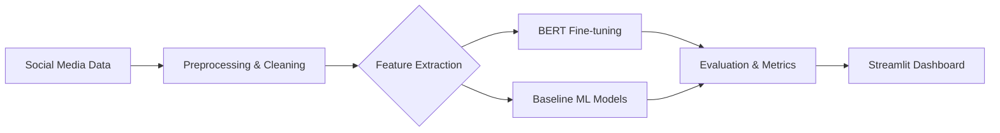

# 🧠 Mental Health Signal Detection from Social Media


**Mental Health NLP** is a sophisticated text classification system designed to detect psychological distress signals in social media posts (Reddit). The system categorizes content into five distinct mental health indicators: **Stress, Depression, Bipolar Disorder, Personality Disorder, and Anxiety.**

---

## 🌊 Pipeline Architecture & Flow



---

## 📊 Results

| Model | Macro F1 Score | Status |
| :--- | :--- | :--- |
| **BERT (Fine-tuned)** | **81.06%** | ✅ Target achieved |
| Logistic Regression | 78.12% | Baseline |
| Naive Bayes | 75.08% | Baseline |

*Target was 80% F1. The BERT model was trained on Google Colab with GPU acceleration.*

---

## 🛠️ Tech Stack

- **Languages:** Python 3.13
- **Deep Learning:** PyTorch + HuggingFace Transformers (BERT)
- **Machine Learning:** Scikit-Learn (Logistic Regression, Naive Bayes)
- **NLP Utilities:** NLTK, spaCy (text preprocessing)
- **Deployment:** Streamlit (interactive dashboard)
- **Hardware:** Google Colab (model training)

---

## 📂 Dataset

The **Reddit Mental Health Dataset** from Kaggle (~5,957 posts).

- **Source:** [Kaggle Dataset Link](https://www.kaggle.com/datasets/neelghoshal/reddit-mental-health-data)
- **Classes:** `stress`, `depression`, `bipolar`, `personality_disorder`, `anxiety`

> **Note:** Dataset and trained model files are excluded from this repository due to size. Follow the setup instructions below to acquire them.

---

## 🚀 Setup & Installation

### 1. Clone the Repository
```bash
git clone https://github.com/Ashhadk7/Mental-Health-NLP.git
cd Mental-Health-NLP
```

### 2. Create Virtual Environment
```bash
python -m venv venv
# Windows:
.\venv\Scripts\activate
# Linux/Mac:
source venv/bin/activate
```

### 3. Install Dependencies
```bash
pip install -r requirements.txt
python -m spacy download en_core_web_sm
```

### 4. Download Data
```bash
python data_downloader.py
```
*Alternatively, manually download from Kaggle and place in `data/raw/`.*

---

## ⚙️ Running the Project

Follow the pipeline steps in order:

1.  **Preprocessing:** Clean and lemmatize raw text.
    ```bash
    python src/preprocessing.py
    ```
2.  **Feature Extraction:** Generate TF-IDF and embeddings.
    ```bash
    python src/features.py
    ```
3.  **Data Split:** Prepare train/test sets.
    ```bash
    python src/split_data.py
    ```
4.  **Baseline Models:** Train and evaluate Logistic Regression & Naive Bayes.
    ```bash
    python src/baseline_models.py
    ```
5.  **Interactive Dashboard:** Launch the Streamlit UI.
    ```bash
    streamlit run app/app.py
    ```

---

## 📁 Project Structure

```text
mental-health-nlp/
├── app/                    # Streamlit dashboard UI
├── data/
│   ├── raw/               # Original dataset (Not tracked)
│   └── processed/         # Cleaned data (Not tracked)
├── models/                # Trained model weights & configs
├── notebooks/             # Google Colab training notebooks
├── src/                   # Source code pipeline
│   ├── preprocessing.py
│   ├── features.py
│   ├── split_data.py
│   ├── baseline_models.py
│   ├── bert_classifier.py
│   └── evaluate_all.py
├── reports/               # Visualization figures and results
├── data_downloader.py     # Kaggle dataset utility script
└── requirements.txt       # Python dependencies
```

---

## 📝 Notes

- Large files (dataset, model weights) are correctly handled via `.gitignore`.
- BERT training was performed on Google Colab GPU due to local hardware constraints.
- Fine-tuned model files should be downloaded separately or retrained using the provided notebooks.

---

## 👨‍💻 Author

**Muhammad Ashhad Khan**